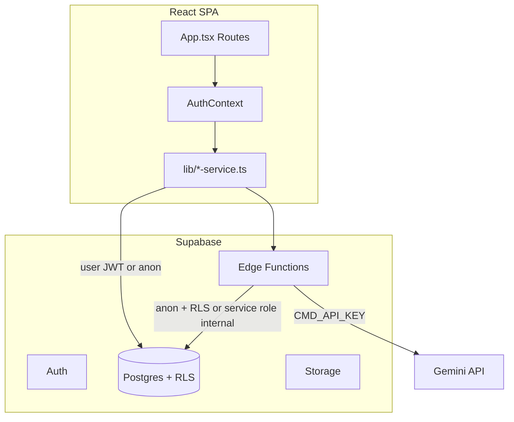

# BizSearch.in — Application Readiness Audit

**Audit date:** 2026-09-08 (re-validated same day)  
**Auditor role:** Product Engineering, QA, Security, Reliability  
**Codebase:** `/home/testbro/Project/bizsearch-new` (branch `main`)  
**Live Supabase:** `https://suiexvkyakjvexnldvmr.supabase.co`

---

## Executive Summary

### Is bizsearch.in ready for real users?

## 🟠 NOT READY (franchise beta possible with fixes)

The codebase has improved materially since an earlier pass on the same day: P0 security migrations (`031`, `032`), Gemini server proxy, business pagination/save fixes, documents vault wired to Supabase, and edge-function auth hardening are **in the repository**. Live `validate:phase1` security probes **mostly pass** on seeded test accounts.

However, the app still lacks automated tests, production observability, SEO infrastructure, and several seller/advisor journeys remain stubbed. One live validation probe reports a franchisor cross-edit failure that is **likely a test-script false positive** (PostgREST returns no error when RLS blocks zero rows) — but this must be verified before launch.

| Launch scope | Verdict |
|--------------|---------|
| Full marketplace (business + franchise + deal room + payments) | 🔴 Not ready |
| Franchise discovery + inquiry + application (Phase 1) | 🟡 Ready with fixes |
| Overall production | 🟠 Not ready |

---

## Changes Since Initial Audit (Same Day)

| Finding (earlier) | Current status |
|-------------------|----------------|
| `.env` committed to git | **FIXED** — `.env` in `.gitignore`; `.env.example` added; `.env` not tracked |
| Privilege escalation via `profiles.role` | **FIXED in migration** `031_p0_security_hardening.sql` (trigger + tightened SELECT) |
| `profile_roles` admin insert | **FIXED in migration** `031` |
| Signup metadata admin role | **FIXED** — hardened `handle_new_user` + Zod excludes `admin` (`validation.ts:90`) |
| `VITE_GOOGLE_AI_API_KEY` in client | **FIXED** — `gemini-proxy` edge fn + `gemini-proxy-client.ts` |
| Business save not persisted | **FIXED** — `useSavedListings` in list + detail pages |
| Unbounded business fetch | **FIXED** — server pagination in `BusinessService.getBusinesses` |
| Business browse silent errors | **FIXED** — `setFetchError` in `business-listings.tsx:108` |
| Synthetic business financials | **FIXED** — removed from `business-detail.tsx` |
| Documents vault mock data | **FIXED** — loads `ProfileService.getVerificationDocuments` |
| `lead-agent` fully public | **FIXED** — JWT for user routes; `EDGE_FUNCTION_SECRET` for cron |
| `api-v1` service role | **FIXED** — uses anon key + optional user JWT (`api-v1/index.ts:76-87`) |
| Notification spam INSERT | **FIXED in migration** `032_p1_security_hardening.sql` |

---

## 1. Application Overview

### Purpose & target users

**BizSearch** (`bizsearch.in`) is an India-focused marketplace for **franchise discovery** (primary) and **business-for-sale listings** (secondary). Target users: franchisees, franchisors, business buyers/sellers, advisors/brokers, and admins.

### User roles

`buyer`, `seller`, `franchisor`, `franchisee`, `advisor`, `broker`, `admin` — with multi-role support via `profile_roles` (`021_multi_role_profiles.sql`).

### Architecture

| Layer | Stack |
|-------|-------|
| Frontend | React 18, TypeScript, Vite, React Router 6, Tailwind, Radix/shadcn |
| Backend | Supabase Postgres + Auth + Storage + Realtime |
| Edge functions | `api-v1`, `nl-search`, `lead-agent`, `quote-agent`, `gemini-proxy` |
| AI | Gemini via authenticated `gemini-proxy` (server `CMD_API_KEY`) |
| Hosting | Vercel SPA (`vercel.json`) |

### External integrations

- Supabase (primary data + auth)
- Google Gemini (via edge proxy)
- Mapbox (`VITE_MAPBOX_TOKEN` — optional)
- No payment provider (Stripe/Razorpay not integrated)
- No transactional email provider (Resend/SendGrid not integrated)

### Background jobs / webhooks

- No `pg_cron` or scheduled functions in repo
- Cron-style endpoints: `lead-agent POST /process-all`, `quote-agent POST /process` — both require `x-edge-function-secret`
- DB trigger: `notify_on_inquiry()` on inquiry insert (`003_notifications.sql`)

### Features not present

- Reviews / ratings (no tables, no UI)
- Payment / subscription processing
- SMS notifications
- `robots.txt` / `sitemap.xml`

---

## 2. Architecture Diagram



### Routing (`src/App.tsx`)

- **Public:** `/`, `/franchises`, `/businesses`, `/franchise/:id`, `/business/:id`, `/smart-search`, legal pages
- **Protected:** dashboard, listings, inquiries, applications, deal room, messages, etc.
- **Admin:** `/admin/*` via `AdminRouteGuard` (frontend `profile.role === 'admin'`)
- **Bug:** duplicate route `/business/edit/:businessId` at lines 443–464

`ProtectedRoute` supports `requiredRole` / `requiredRoles` but **no route uses them** — all protected pages are login-only.

---

## 3. User Flow Map

### Anonymous

| Flow | Route | Status |
|------|-------|--------|
| Landing | `/` | PASS |
| Franchise browse/filter/sort/paginate | `/franchises` | PASS (server filters + client refine) |
| Business browse/filter/paginate | `/businesses`, `/search` | PASS (server pagination; some filters client-side) |
| Franchise detail + share | `/franchise/:id` | PASS |
| Business detail + share | `/business/:id` | PASS |
| NL search | `/smart-search` | PARTIAL (errors console-only) |
| Map discovery | `/franchise-map` | PARTIAL (feature flag) |
| Invalid URL | `*` | PASS → `NotFoundPage` |
| Empty search results | — | PASS (`EmptyState`) |

### Registration & auth

| Flow | Status | Evidence |
|------|--------|----------|
| Email signup + role picker | PASS | `sign-up-form.tsx:377-384` |
| Strong password validation | PASS | `validation.ts:84-98` |
| Phone OTP | PASS | `AuthContext.tsx` phone methods |
| Login + wrong password | PASS | `sign-in-form.tsx:59-61` |
| Post-login onboarding redirect | PASS | `sign-in-form.tsx:77-80` |
| Forgot / reset password | PASS | auth pages + `AuthContext` |
| Remember me | PARTIAL | UI only — no persistence (`sign-in-form.tsx:22`) |
| Account deletion | FAIL | Signs out only; no user deletion (`AuthContext.tsx:1004-1022`) |
| Session from localStorage bootstrap | RISK | `AuthContext.tsx:279-301` |

### Search (exhaustive)

| Scenario | Status | Notes |
|----------|--------|-------|
| Empty query (NL) | PASS | Early return |
| 1-char query (NL) | PASS | Min 3 chars at edge fn |
| 500+ chars (NL) | PASS | Rejected at edge |
| SQL/HTML injection strings (NL) | PASS | Sanitized `nl-search/index.ts` |
| Unicode / Tamil / emoji | PASS | JS string ops; DB `ilike` |
| No results | PASS | "No details found in the table." |
| Thousands of results (business browse) | PASS | Paginated (`pageSize` default 50) |
| API failure (business browse) | PASS | User-visible `fetchError` |
| API failure (NL search) | FAIL | `console.error` only |
| Concurrent / stale NL results | RISK | No abort controller |
| Rapid repeated searches | RISK | No debounce on NL submit |
| URL sharing `?q=` | PASS | `business-listings.tsx` reads URL |
| Inactive/deleted listings in search | PASS | `status=active` filter in services |

### Business discovery

| Scenario | Status |
|----------|--------|
| Missing images | PARTIAL — Unsplash fallbacks (`business-detail.tsx:103-112`) |
| Missing financials | PASS — no synthetic estimates (removed) |
| Save / favorite | PASS — `toggleSave('business', id)` |
| Save while logged out | PASS — toast + redirect login |
| Contact seller | PASS — `InquiryDialog` |
| Unpublished draft via direct URL | PASS — RLS hides non-active for anon |
| Reviews | N/A |

### Favorites / saved items

| Scenario | Status |
|----------|--------|
| Franchise save | PASS |
| Business save | PASS (fixed) |
| Cross-device | PASS (Supabase `saved_listings`) |
| Deleted listing in saved | PARTIAL — may show broken card (N+1 hydrate) |
| Duplicate save | PASS — DB unique constraint |

### Franchise applications

| Scenario | Status |
|----------|--------|
| Multi-step apply | PASS | `franchise-application.tsx` |
| My applications | PASS | RLS `user_id` scoped |
| Franchisor review | PASS | `franchisor-applications.tsx` |
| Duplicate application | FAIL/RISK | No `UNIQUE(user_id, franchise_id)` in `011_franchise_applications_messaging.sql:5-19` |
| Double-click submit | RISK | No idempotency key |

### Admin

| Flow | Status |
|------|--------|
| Admin route guard | PARTIAL — frontend only; RLS `is_admin()` is backstop |
| Listing approve/reject | PASS | `admin-listings.tsx` |
| User ban / role change | FAIL | Menu items unwired (`admin-users.tsx` — no handlers) |
| Content management | FAIL | Mock data (`admin-content.tsx`) |
| Settings persistence | FAIL | Local-only (`admin-settings.tsx`) |
| Feature flags | PASS | DB-backed |

### Reviews / ratings

**Not implemented** — no schema, no UI, matrix rows N/A.

---

## 4. State Transition Analysis

### Auth session lifecycle

```text
Anonymous → Login → Session (localStorage + Supabase) → Protected action
    ↓ expired token
AuthContext may briefly trust cached localStorage (lines 279-301)
    ↓
ProtectedRoute → redirect /login (preserves from state)
```

**Gaps:**
- Refresh during mutation: no global mutation-in-flight guard
- Multi-tab logout: storage listener may use wrong key pattern
- Password change: no explicit global session invalidation beyond Supabase defaults

### Inquiry submit

```text
Open dialog → fill form → submit → InquiryService.createInquiry
    ↓ double-click
No idempotency — duplicate rows possible (RISK)
    ↓ network fail mid-flight
User may retry → duplicate (RISK)
```

---

## 5. API & Backend Audit

### Supabase tables (key entities)

`profiles`, `profile_roles`, `businesses`, `franchises`, `saved_listings`, `inquiries`, `franchise_applications`, `conversations`, `messages`, `notifications`, `verification_documents`, `nda_agreements`, `deal_room_documents`, `listing_analytics`, `feature_flags`

### Edge functions

| Function | Auth | Data access | Rate limit |
|----------|------|-------------|------------|
| `gemini-proxy` | JWT required | N/A | Prompt length cap |
| `nl-search` | Optional JWT | Anon client + RLS | Query/limit caps |
| `api-v1` | Optional JWT | Anon client + RLS | `MAX_LIMIT=100` |
| `lead-agent` | JWT (user routes); secret (cron) | Service role internal | None |
| `quote-agent` | JWT (user routes); secret (cron) | User-scoped | Listing count cap |

### IDOR / BOLA (live-tested where possible)

| Probe | Result | Notes |
|-------|--------|-------|
| Entrepreneur A sees others' inquiries | **PASS** | `validate:phase1` 2026-09-08 |
| Franchisor A sees Franchisor B leads | **PASS** | Same run |
| Entrepreneur A sees B's applications | **PASS** | Same run |
| Franchisor A updates Franchisor B franchise | **FAIL (probe)** | See note below |

**Franchisor cross-edit probe note:** `phase1-production-validation.mjs:327-337` treats `error === null` as success. PostgREST typically returns **no error when RLS blocks all rows** (0 rows updated). This is likely a **false positive** in the validation script, not a confirmed RLS breach. **Fix the probe** to use `.select('id')` and assert `data.length === 0` before re-auditing.

### Remaining open INSERT policies

- `listing_analytics` — `WITH CHECK (true)` (`012_business_seller_features.sql:199-201`) — analytics spam risk (P2)

---

## 6. Security Findings

### Resolved (in codebase — verify migrations applied on live DB)

| ID | Issue | Fix location |
|----|-------|--------------|
| SEC-R01 | Profile PII world-readable | `031` — `public_profiles` view + restricted SELECT |
| SEC-R02 | Self-service role escalation | `031` — `prevent_profile_privilege_escalation` trigger |
| SEC-R03 | Admin via `profile_roles` | `031` — policy + trigger |
| SEC-R04 | Signup admin injection | `031` — `handle_new_user` whitelist |
| SEC-R05 | Gemini key in browser | `gemini-proxy` + `gemini-proxy-client.ts` |
| SEC-R06 | Notification INSERT spam | `032` — REVOKE INSERT |
| SEC-R07 | lead-agent public service role | `lead-agent/index.ts:35-72` |
| SEC-R08 | Secrets in git | `.gitignore` + `.env.example` |

### Still open

| ID | Severity | Issue | Evidence |
|----|----------|-------|----------|
| SEC-01 | P1 | `ProtectedRoute` role gating unused | `App.tsx` — no `requiredRole` |
| SEC-02 | P2 | `api-v1` / `nl-search` public, CORS `*` | Scraping/abuse risk |
| SEC-03 | P2 | No app-level rate limiting | — |
| SEC-04 | P2 | `listing_analytics` open INSERT | `012:199-201` |
| SEC-05 | P2 | Verification logs world-readable | `022:143-146` |
| SEC-06 | P2 | No CSP / security headers in `index.html` | — |
| SEC-07 | P2 | `detail_tables` on other users' profiles may leak if RLS misconfigured | `use-profile-data.ts:70-75` |
| SEC-08 | P3 | `AuthContext` localStorage session bootstrap | `AuthContext.tsx:279-301` |

---

## 7. Confirmed Bugs (Current)

### BUG-001: Duplicate franchise applications possible

**Flow:** Franchise → Apply → Submit twice  
**Root cause:** No `UNIQUE (user_id, franchise_id)` on `franchise_applications`  
**Severity:** P2  
**File:** `supabase/migrations/011_franchise_applications_messaging.sql:5-19`  
**Fix:** Add unique partial index; handle 409 in UI

### BUG-002: Admin user ban/role change unwired

**Flow:** Admin → Users → Ban  
**Root cause:** Dropdown menu items have no handlers  
**Severity:** P2  
**File:** `src/polymet/pages/admin/admin-users.tsx`

### BUG-003: Account deletion does not delete account

**Flow:** Settings → Delete account  
**Root cause:** Client signs out only; comment notes server function needed  
**Severity:** P2  
**File:** `src/contexts/AuthContext.tsx:1004-1022`

### BUG-004: Profile messaging stub

**Flow:** Profile → Send Message  
**Root cause:** `console.log` TODO  
**Severity:** P2  
**File:** `src/polymet/pages/profile.tsx:105-108`

### BUG-005: NL search errors silent to user

**Flow:** Smart search → API failure  
**Severity:** P2  
**File:** `src/components/natural-language-search.tsx` (catch logs only)

### BUG-006: Duplicate route registration

**Severity:** P3  
**File:** `src/App.tsx:443-464`

### BUG-007: validate:phase1 franchisor edit false positive (likely)

**Severity:** P3 (tooling)  
**File:** `scripts/phase1-production-validation.mjs:327-337`

---

## 8. Data Integrity

| Check | Status |
|-------|--------|
| FK on franchise_applications | PASS |
| Unique saved_listings | PASS |
| Orphaned saved_listings after delete | PARTIAL — hydrate may fail silently |
| Franchise slug uniqueness | PASS (`020_auto_slug_generation.sql`) |
| Inquiry NULL status (live sample) | PASS — `validate:phase1` |
| Soft-delete vs search index | PARTIAL — status enum, no deleted_at |
| Transaction boundaries on application submit | UNKNOWN — needs live trace |

---

## 9. Concurrency & Race Conditions

| Scenario | Mitigation | Status |
|----------|------------|--------|
| Double save franchise | DB unique | PASS |
| Double inquiry submit | None | RISK |
| Concurrent NL search | None | RISK |
| Two admins edit listing | Last write wins | RISK |
| Optimistic save toggle | Context refresh | PARTIAL |

---

## 10. Performance

| Risk | Severity | Evidence |
|------|----------|----------|
| 2.49 MB JS bundle | P2 | `npm run build` 2026-09-08 |
| Saved listings N+1 hydrate | P2 | `saved-listings-service.ts` |
| Franchise compare parallel fetches | P2 | `franchise-detail.tsx` |
| Client-side subcategory filters after server page | P3 | `business-listings.tsx:117+` |
| GIN full-text indexes | OK | `002_business_listings.sql` |

---

## 11. Accessibility

| Check | Status |
|-------|--------|
| Form labels (auth) | PASS |
| Radix dialog focus trap | PASS |
| `aria-*` usage | PARTIAL (~20 files) |
| `aria-live` for async errors | PARTIAL |
| Color contrast | UNKNOWN |
| Keyboard nav all flows | UNKNOWN |

---

## 12. SEO

| Item | Status |
|------|--------|
| Static meta `index.html` | PASS |
| Per-listing title/description | FAIL |
| `robots.txt` / sitemap | FAIL |
| JSON-LD on listings | FAIL (`schema-markup.tsx` unused) |
| Global `WebsiteSchema` | PASS (`App.tsx:100`) |
| SPA crawlability | RISK — client-rendered detail pages |

---

## 13. Observability & Deployment

| Item | Status |
|------|--------|
| `ErrorBoundary` | PASS — wraps app |
| Sentry / monitoring | FAIL — not integrated |
| Structured logging | FAIL — `console.*` only |
| `validate:phase1` | PASS — connectivity + partial security |
| `.env.example` | PASS |
| Migrations (32 files) | Must be applied manually on fresh deploy |
| `EDGE_FUNCTION_SECRET` / `CMD_API_KEY` | Required for production edge functions |

---

## 14. Test Results (2026-09-08)

| Command | Result |
|---------|--------|
| `npm run build` | ✅ Pass (2,489 KB JS, gzip 639 KB) |
| `npx tsc --noEmit` | ✅ Pass |
| `npm run lint` | ❌ 599 problems (546 errors) |
| `npm run validate:phase1` | ⚠️ See below |
| Unit / integration / E2E | ❌ None |

### `validate:phase1` security summary (live)

```json
{
  "entrepreneurA_own": "PASS",
  "franchisorA_cross": "PASS",
  "franchisorA_edit_other": "FAIL",
  "entrepreneurA_cross_apps": "PASS"
}
```

**Verdict from script:** `CODE COMPLETE — LIVE VALIDATION PENDING`

---

## 15. User-Flow Test Matrix (Abbreviated — 80+ scenarios traced)

| Flow | Scenario | Expected | Current | Status | Sev | Evidence |
|------|----------|----------|---------|--------|-----|----------|
| Security | Self-assign admin | Denied | Trigger in `031` | PASS* | P0 | `031:46-73` |
| Security | Read others' email via profiles | Denied | `public_profiles` view | PASS* | P0 | `031:7-28`, `use-profile-data.ts:47` |
| Security | Cross-franchisor leads | Denied | RLS | PASS | P0 | live validate |
| Security | Cross-franchisor edit | Denied | RLS | UNKNOWN | P0 | probe likely FP |
| Login | Wrong password | Error shown | Supabase error | PASS | — | sign-in-form |
| Signup | Weak password | Rejected | Zod | PASS | — | validation.ts |
| Signup | Admin role | Rejected | Zod + trigger | PASS | — | validation.ts:90, 031:119-156 |
| Search | Empty NL query | No-op | Early return | PASS | — | natural-language-search |
| Search | 10k businesses | Paginated | Server page | PASS | P1 | business-service.ts:69-81 |
| Search | Business API fail | Error UI | fetchError | PASS | P2 | business-listings.tsx:108 |
| Business | Save | Persisted | toggleSave | PASS | P1 | business-detail.tsx:114-123 |
| Business | Missing images | Placeholder | Unsplash | PARTIAL | P2 | business-detail.tsx:103-112 |
| Franchise | Save | Persisted | Context | PASS | — | franchise-detail |
| Franchise | Apply twice | One row | No unique constraint | FAIL | P2 | 011:5-19 |
| Favorites | Cross-device | Synced | Supabase | PASS | — | SavedListingsContext |
| Profile | Documents | Real docs | ProfileService | PASS | P1 | documents-vault.tsx:93 |
| Profile | Message other user | Opens chat | console.log | FAIL | P2 | profile.tsx:105-108 |
| Admin | Ban user | Works | Unwired | FAIL | P2 | admin-users.tsx |
| Account | Delete | Data removed | Sign out only | FAIL | P2 | AuthContext.tsx:1004 |
| Reviews | Any | N/A | Not built | N/A | — | — |
| SEO | Franchise detail meta | Per-page | Static shell | FAIL | P2 | — |
| Abuse | Scrape api-v1 | Throttled | Public GET | RISK | P2 | api-v1 |
| Concurrency | Double inquiry | One row | No idempotency | RISK | P2 | InquiryService |

\*PASS assumes migration `031`/`032` applied on live database (partially corroborated by passing isolation probes).

---

## 16. Broken User Journeys (Current)

1. **Message user from profile** — stub only  
2. **Delete account with data removal** — signs out only  
3. **Admin ban/suspend user from UI** — not wired  
4. **Transactional email** (inquiry received, application status) — not implemented  
5. **Payments / subscriptions** — not implemented despite legal copy  
6. **Duplicate franchise application prevention** — not enforced at DB level  

**Previously broken, now fixed:** business save, business browse at scale, documents vault, several P0 security items.

---

## 17. Missing Test Coverage

No test framework configured. Priority automation:

1. RLS integration (port `validate:phase1` probes to CI with `.select()` fix)
2. Inquiry create + duplicate submit
3. Franchise application lifecycle
4. Saved listings idempotency
5. Business pagination filters
6. `gemini-proxy` 401 without JWT
7. Admin listing approve/reject

---

## 18. Technical Debt

- `ProtectedRoute` role support unused
- Dead code: `search-bar.tsx`, `schema-markup.tsx`
- 599 lint errors (mostly `any` in edge functions)
- 2.5 MB single bundle — needs code splitting
- Admin content/settings mock UIs
- Three search stacks (browse URL, `nl-search`, unused Gemini bar)
- `console.log` debug in production services

---

## 19. Recommended Fix Order

```text
1. Fix validate:phase1 franchisor edit probe (check rows updated, not just error)
2. Confirm migrations 031 + 032 applied on production Supabase
3. Add UNIQUE(user_id, franchise_id) on franchise_applications + UI 409 handling
4. Wire admin ban/role-change OR remove misleading UI
5. Implement account deletion edge function (or remove UI claim)
6. Add user-visible errors on NL search failures
7. Apply requiredRole on seller/franchisor-only routes (defense in depth)
8. Add robots.txt, sitemap, SEOHead on franchise/business detail pages
9. Add Vitest + Playwright; run validate:phase1 in CI with seeded accounts
10. Add Sentry; strip debug console.log from services
11. Rate-limit public edge functions
12. Re-run full audit
```

---

## 20. Overall Readiness Verdict

| Question | Answer |
|----------|--------|
| Safe for public internet today? | **No** — verify migration deployment + fix validation probe + close remaining P1/P2 security gaps |
| Franchise Phase 1 beta (invite-only)? | **Possible** after confirming `031`/`032` on live DB and fixing probe/documentation |
| Full bizsearch.in marketplace? | **Not ready** — payments, email, reviews, tests, SEO, observability missing |

### Severity summary

**P0 (open):** Verify franchisor cross-edit probe; confirm `031`/`032` live  
**P1:** Role gating unused; public API abuse surface  
**P2:** Duplicate applications, admin ban, account delete, NL errors, SEO, analytics spam, no tests/monitoring  
**P3:** Duplicate route, lint debt, bundle size, Unsplash fallbacks  

---

## Appendix: Key Files

| Area | Path |
|------|------|
| Routes | `src/App.tsx` |
| Auth | `src/contexts/AuthContext.tsx` |
| P0 security migration | `supabase/migrations/031_p0_security_hardening.sql` |
| P1 notification hardening | `supabase/migrations/032_p1_security_hardening.sql` |
| Business listings | `src/lib/business-service.ts`, `src/polymet/pages/business-listings.tsx` |
| Saved listings | `src/contexts/SavedListingsContext.tsx` |
| Gemini proxy | `supabase/functions/gemini-proxy/index.ts`, `src/lib/gemini-proxy-client.ts` |
| Live validation | `scripts/phase1-production-validation.mjs` |
| Env template | `.env.example` |

---

*Methodology: source inspection, execution-path tracing, `npm run build` / `tsc` / `lint` / `validate:phase1` on 2026-09-08. Distinctions: **Confirmed** (code/live evidence), **Likely** (strong inference), **Risk** (needs validation), **Unknown** (not verifiable from code alone).*
