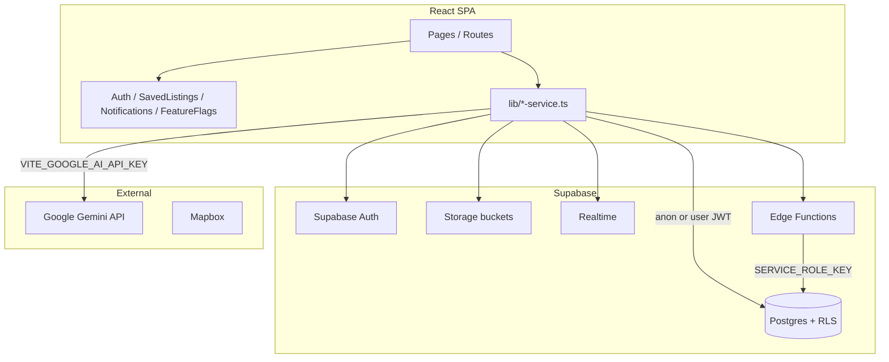

# BizSearch.in — Application Readiness Audit

**Audit date:** 2026-09-08  
**Auditor role:** Product Engineering, QA, Security, Reliability  
**Codebase:** `/home/testbro/Project/bizsearch-new` (branch `main`)  
**Live Supabase:** `https://suiexvkyakjvexnldvmr.supabase.co` (connectivity confirmed via `validate:phase1`)

---

## Executive Summary

### Is bizsearch.in ready for real users?

## 🔴 CRITICAL ISSUES — DO NOT DEPLOY

The application has a polished franchise-first UI and meaningful Supabase-backed flows for franchise discovery, inquiries, and applications. However, **confirmed security defects** (privilege escalation, secrets in version control, unauthenticated service-role edge functions, public PII exposure) and **broken core business journeys** (business save/favorites, unbounded listing fetch, mock data on detail pages) make it unsafe and unreliable for production users.

**Evidence-based verdict:**

| Area | Status |
|------|--------|
| Franchise browse + detail + inquiry | **PARTIAL** — works for active franchises; scale/error gaps |
| Business browse + detail + save | **FAIL** — save not persisted; performance risk |
| Auth (login/signup/reset) | **PARTIAL** — Supabase Auth works; escalation vectors in DB |
| Authorization / RLS | **FAIL** — critical policy gaps |
| Admin | **PARTIAL** — UI exists; some actions unwired; guard is frontend-only |
| Payments | **N/A** — not implemented |
| Reviews/ratings | **N/A** — no review system in codebase |
| Automated tests | **FAIL** — zero unit/integration/E2E tests |
| SEO (SPA) | **PARTIAL** — static meta only; no sitemap/robots/per-page SEO |
| Observability | **FAIL** — console logging only |

---

## 1. Application Overview

### Purpose & target users

**BizSearch** is an India-focused marketplace for **franchise discovery** and **business-for-sale listings**. Users can search/compare franchises, submit inquiries and formal franchise applications, manage leads (franchisors), and access seller/buyer/advisor tooling (deal room, NDAs, commissions, etc.).

### User types / roles

Defined in DB enum and auth types: `buyer`, `seller`, `franchisor`, `franchisee`, `advisor`, `broker`, `admin`.

Multi-role support via `profile_roles` table (`021_multi_role_profiles.sql`).

### Tech stack

| Layer | Technology |
|-------|------------|
| Frontend | React 18, TypeScript, Vite, React Router 6, Tailwind, Radix/shadcn |
| Backend | Supabase (Postgres + Auth + Storage + Realtime) |
| Edge functions | Deno (`api-v1`, `nl-search`, `lead-agent`, `quote-agent`) |
| AI | Google Generative AI (Gemini) — **client-side** |
| Maps | Mapbox (token in `.env`, limited usage) |
| Hosting | Vercel SPA (`vercel.json`) |

### Major features (by maturity)

| Feature | Maturity |
|---------|----------|
| Franchise listings + detail + map | Production-oriented |
| Franchise inquiry + application pipeline | Production-oriented (Phase 1 focus) |
| Natural language search (`nl-search` edge fn) | Functional |
| Business listings browse | Functional but fragile at scale |
| Saved listings / favorites | **Franchise only** (business broken) |
| Messaging | Schema + service; UI partially stubbed |
| Deal room / NDA | Schema + partial UI |
| Admin dashboard | Mixed real data + mock UI |
| Payments / subscriptions | Not implemented |
| Reviews / ratings | Not implemented |
| Email notifications (transactional) | Not implemented (in-app only) |

---

## 2. Architecture Understanding



### Routing

All routes in `src/App.tsx` (lines 101–727). Notable patterns:

- Public: `/`, `/franchises`, `/businesses`, `/franchise/:id`, `/business/:id`, auth pages
- `ProtectedRoute`: most authenticated flows (no `requiredRole` ever passed — lines 40–148 in `protected-route.tsx`)
- `AdminRouteGuard`: `/admin/*` (checks `profile.role === 'admin'` only)

**Duplicate route bug:** `/business/edit/:businessId` registered twice (`App.tsx` lines 443–464).

### Data access pattern inconsistency

Many services use **raw `fetch` with anon key** instead of the authenticated Supabase client:

```57:77:src/lib/business-service.ts
  static async getBusinesses(filters?: BusinessFilters) {
    // ...
    const response = await fetch(
      `${supabaseUrl}/rest/v1/businesses?select=*&order=created_at.desc`,
      {
        headers: {
          'apikey': supabaseKey,
          'Authorization': `Bearer ${supabaseKey}`,
```

Implication: RLS always evaluates as **anonymous**, never as the logged-in user. Owner-only rows (drafts) are hidden correctly by RLS, but user-scoped operations cannot rely on this pattern.

---

## 3. User Flow Map

### Anonymous user

| Journey | Route(s) | Backend |
|---------|----------|---------|
| Landing | `/` | Static + featured franchises from Supabase |
| Browse franchises | `/franchises` | `FranchiseService.getFranchises` |
| Browse businesses | `/businesses`, `/search` | `BusinessService.getBusinesses` (full table) |
| Franchise detail | `/franchise/:id` | `getPublicFranchiseByIdOrSlug` |
| Business detail | `/business/:id` | `getBusinessByIdOrSlug` |
| Smart search | `/smart-search` | Edge fn `nl-search` |
| Map discovery | `/franchise-map` | Feature-flag gated |
| Industries | `/industries`, `/industry/:slug` | Partial SEO via `SEOHead` |
| Legal / help | `/privacy`, `/terms`, `/help`, etc. | Static pages |

### Registration & login

| Journey | Route | Implementation |
|---------|-------|----------------|
| Sign up | `/signup` | `sign-up-form.tsx` → `supabase.auth.signUp` + metadata role |
| Login | `/login` | `sign-in-form.tsx` → `AuthContext.signIn` |
| Phone OTP | Auth forms | `AuthContext` phone methods |
| Forgot password | `/forgot-password` | `resetPasswordForEmail` |
| Reset password | `/reset-password` | `updateUser({ password })` |
| Onboarding | `/onboarding` | Protected multi-step |
| Profile setup | `/profile/setup` | Protected |

### Authenticated — buyer / franchisee

| Journey | Route | Notes |
|---------|-------|-------|
| Dashboard | `/dashboard`, `/profile` | Same component |
| Saved listings | `/saved` | Works for franchises |
| Franchise application | `/franchise/:id/apply` | Multi-step form + `InquiryService` |
| My applications | `/my-applications` | RLS-scoped |
| Buyer mandate | `/buyer/mandate` | Protected |
| Messages | `/messages` | Protected |

### Authenticated — seller / franchisor

| Journey | Route | Notes |
|---------|-------|-------|
| Add business | `/add-business-listing` | Protected, no role gate |
| Add franchise | `/add-franchise-listing` | Protected |
| My listings | `/my-listings` | Protected |
| Lead management | `/leads`, `/pipeline` | Protected |
| Franchisor applications | `/franchisor/applications` | Protected |
| Buyer inquiries | `/buyer-inquiries` | Protected |
| Deal room | `/deal-room/:businessId` | Protected |
| NDA management | `/nda-management` | Protected |
| Seller analytics | `/seller-analytics` | Protected |

### Admin

| Journey | Route | Notes |
|---------|-------|-------|
| Dashboard | `/admin` | Stats from `AdminService` |
| Users | `/admin/users`, `/admin/users/:id` | Ban/role change UI unwired |
| Listings moderation | `/admin/listings` | Approve/reject wired |
| Verification | `/admin/verification` | Wired |
| Documents | `/admin/documents` | Wired |
| Content | `/admin/content` | **Mock data** |
| Feature flags | `/admin/feature-flags` | Wired to DB |
| Settings | `/admin/settings` | **Local-only** |

### Not implemented / stubbed

- Reviews and ratings (no tables, no UI)
- Payment / subscription processing
- Transactional email
- Business valuation (`/business-valuation` is **public**, not protected)
- Profile messaging button (`profile.tsx` line 107: `// TODO: Implement messaging`)
- Document upload on profile (`profile-documents.tsx` line 136: `console.log` only)
- Listing wizard image upload uses mock URLs (`file-uploader.tsx`)

---

## 4. Test Results

| Command | Result | Notes |
|---------|--------|-------|
| `npm run build` | **PASS** | Built in ~11s; bundle **2.5 MB** gzip 645 KB — performance warning |
| `npx tsc --noEmit` | **PASS** | No TypeScript errors |
| `npm run lint` | **FAIL** | **621 problems** (568 errors, 53 warnings) — mostly `@typescript-eslint/no-explicit-any` |
| `npm run validate:phase1` | **PARTIAL** | Connectivity + anon discovery OK; security probes **skipped** (no test accounts / service key) |
| Unit / integration / E2E tests | **NONE** | No `*.test.*` or `*.spec.*` files; no Vitest/Jest/Playwright config |

### `validate:phase1` output (2026-09-08)

```
✅ connectivity: Supabase reachable
✅ migration028: Inquiry statuses compatible
✅ discovery: Public discovery returns 3 active franchise(s) only
⚠️ security probes: SKIPPED (test accounts missing)
Verdict: CODE COMPLETE — LIVE VALIDATION PENDING
```

---

## 5. Edge-Case & User-Flow Test Matrix

Severity: **P0** critical, **P1** high, **P2** medium, **P3** low.

| Flow | Scenario | Expected | Current behavior | Status | Sev | Evidence |
|------|----------|----------|------------------|--------|-----|----------|
| **Security** | User updates `profiles.role` to `admin` | Denied | RLS allows self-UPDATE on all columns | **FAIL** | P0 | `001_initial_schema.sql:112-114` |
| **Security** | User inserts `profile_roles` with `admin` | Denied | INSERT allowed for own profile_id | **FAIL** | P0 | `021_multi_role_profiles.sql:167-168` |
| **Security** | Signup API with `user_metadata.role=admin` | Reject / force `buyer` | Trigger sets role from metadata | **FAIL** | P0 | `001_initial_schema.sql:214-220`, `validation.ts:90` |
| **Security** | `.env` in git | Secrets not committed | `.env` is tracked (`git ls-files .env`) | **FAIL** | P0 | `.gitignore` (only `node_modules`), `.env` |
| **Security** | Call `lead-agent` GET `/seller/{uuid}` | 401 / forbidden | Service role, no auth, CORS `*` | **FAIL** | P0 | `lead-agent/index.ts:41-43` |
| **Security** | Read any user profile via REST | Own fields only or public subset | `USING (true)` on SELECT | **FAIL** | P0 | `001_initial_schema.sql:104-106` |
| **Security** | Steal Gemini quota | Key server-side only | `VITE_GOOGLE_AI_API_KEY` in client bundle | **FAIL** | P0 | `ai-smart-search-service.ts:5` |
| **Security** | Spam notifications table | Only system/triggers insert | `WITH CHECK (true)` on INSERT | **FAIL** | P1 | `003_notifications.sql:52-54` |
| **Security** | Inflate listing analytics | Authenticated insert only | `WITH CHECK (true)` for anyone | **FAIL** | P2 | `012_business_seller_features.sql:199-201` |
| **Login** | Wrong password | Clear error | Supabase error formatted in UI | **PASS** | — | `validation.ts:178+`, sign-in form |
| **Login** | Unverified email | Actionable message | Supabase error handling | **PARTIAL** | P2 | Depends on Supabase project email settings |
| **Login** | Session expired mid-action | Re-auth prompt | ProtectedRoute redirects; some services use anon fetch | **PARTIAL** | P2 | `protected-route.tsx:93-95`, `business-service.ts` |
| **Login** | Auth init from localStorage | Server-validated session | Client trusts `expires_at` before `getSession` | **RISK** | P2 | `AuthContext.tsx:279-301` |
| **Signup** | Weak password | Rejected | Zod strong password schema | **PASS** | — | `validation.ts:84-98` |
| **Signup** | Duplicate email | Clear error | Supabase signup error | **PASS** | — | sign-up form |
| **Signup** | Pick role in UI | Limited roles | UI excludes admin; schema allows admin | **PARTIAL** | P0 | `sign-up-form.tsx:377-384`, `validation.ts:90` |
| **Password reset** | Unknown email | Generic success (no leak) | Supabase default behavior | **PARTIAL** | P3 | forgot-password flow |
| **Password reset** | Expired token | Error + re-request | URL error params handled | **PASS** | — | `reset-password-form.tsx` |
| **Search (NL)** | Empty query | Disabled / prompt | `if (!query.trim()) return` | **PASS** | — | `natural-language-search.tsx:67-68` |
| **Search (NL)** | 500+ char query | Truncated/rejected | Edge fn max 500 | **PASS** | — | `nl-search/index.ts:11-13` |
| **Search (NL)** | SQL injection string | Safe handling | Sanitized + parameterized queries | **PASS** | — | `nl-search/index.ts:72-80` |
| **Search (NL)** | API failure | User-visible error | `console.error` only | **FAIL** | P2 | `natural-language-search.tsx:80-82` |
| **Search (browse)** | Empty `?q=` on businesses | Show all / prompt | Client filter on full dataset | **PARTIAL** | P3 | `business-listings.tsx:108-117` |
| **Search (browse)** | 10k+ businesses | Paginated server query | Fetches **entire table** client-side | **FAIL** | P1 | `business-service.ts:67-68`, `business-listings.tsx:83` |
| **Search (browse)** | Special chars in query | No crash | Client `.includes()` — safe | **PASS** | — | `business-listings.tsx:110-116` |
| **Search (browse)** | Tamil/Unicode | Works if data matches | Unicode-safe JS string ops | **PASS** | — | Same filter logic |
| **Search (browse)** | API 500 | Error UI | Sets `businesses=[]`, no error message | **FAIL** | P2 | `business-listings.tsx:92-95` |
| **Franchise browse** | No franchises | Empty state | `EmptyState type="no-data"` | **PASS** | — | `franchise-listings.tsx:430-444` |
| **Franchise browse** | API error | Error UI | `EmptyState type="error"` | **PASS** | — | `franchise-listings.tsx:413-427` |
| **Franchise detail** | Invalid ID | 404 UI | "Franchise Not Found" | **PASS** | — | `franchise-detail.tsx:190-201` |
| **Franchise detail** | Save (logged in) | Persisted | `SavedListingsContext` + Supabase | **PASS** | — | `franchise-detail.tsx:107-116` |
| **Franchise detail** | Save (logged out) | Auth prompt | Auth gate on save | **PASS** | — | franchise detail |
| **Franchise detail** | Inactive franchise | 404 for anon | `getPublicFranchiseByIdOrSlug` filters | **PASS** | — | `franchise-service.ts:265-278` |
| **Business detail** | Invalid ID | 404 UI | "Business Not Found" | **PASS** | — | `business-detail.tsx:82-90` |
| **Business detail** | Draft business URL (owner) | Visible to owner | Anon fetch — owner draft **hidden** | **FAIL** | P2 | `business-service.ts` uses anon key |
| **Business detail** | Missing financials | "N/A" / empty | **Synthetic 15% profit estimate** | **FAIL** | P1 | `business-detail.tsx:99-118` |
| **Business detail** | Missing images | Placeholder | Hardcoded Unsplash URLs | **PARTIAL** | P2 | `business-detail.tsx:152-161` |
| **Business detail** | Save listing | Persisted to DB | **Local state only** | **FAIL** | P1 | `business-detail.tsx:163-165` |
| **Business list** | Save heart icon | Persisted | **Local `Set` only** | **FAIL** | P1 | `business-listings.tsx:307-317` |
| **Saved page** | Business saves | Listed | Only franchise saves in DB | **FAIL** | P1 | `SavedListingsContext` + business save bug |
| **Inquiry** | Submit while logged out | Login prompt | Inquiry dialog gates auth | **PASS** | — | `inquiry-dialog.tsx` |
| **Inquiry** | Double submit | One record | No idempotency key; button disable only | **RISK** | P2 | `InquiryService.createInquiry` |
| **Inquiry** | Spoof `recipient_id` | Server validates ownership | RLS checks `sender_id` only on INSERT | **RISK** | P2 | `028_phase1_franchise_leads.sql:57-60` |
| **Franchise apply** | Multi-step abandon | Draft saved? | No draft persistence observed | **PARTIAL** | P2 | `franchise-application.tsx` |
| **Franchise apply** | Duplicate application | Prevented | **UNKNOWN** — needs DB unique constraint check | **UNKNOWN** | P2 | — |
| **Profile** | View other user `/profile/:id` | Public-safe fields | Full `profiles.*` + detail tables if RLS allows | **PARTIAL** | P1 | `use-profile-data.ts:46-73`, public profiles RLS |
| **Profile** | Documents tab (other user) | Real docs or hidden | **Mock documents displayed** | **FAIL** | P1 | `documents-vault.tsx:254` |
| **Profile** | Send message | Opens conversation | `console.log` stub | **FAIL** | P2 | `profile.tsx:105-108` |
| **Admin** | Non-admin hits `/admin` | 403 | Inline UI block (frontend) | **PARTIAL** | P1 | `admin-route-guard.tsx:31-52` |
| **Admin** | Non-admin calls admin APIs | 403 from RLS | `is_admin()` policies | **PASS** | — | `010_admin_rls_policies.sql` |
| **Admin** | Ban user from UI | User banned | Menu item **not wired** | **FAIL** | P2 | `admin-users.tsx` (per exploration) |
| **Deal room** | Buyer accesses other's deal | Denied | RLS on documents | **PARTIAL** | P1 | `012_business_seller_features.sql` |
| **Messages** | Read other's messages | Denied | Conversation RLS | **PASS** | — | `011_franchise_applications_messaging.sql:123-131` |
| **404** | Unknown route | 404 page | `NotFoundPage` | **PASS** | — | `App.tsx:727` |
| **Mobile** | Long franchise name | No overflow | Tailwind truncate in cards | **PARTIAL** | P3 | franchise-card components |
| **A11y** | Form labels | Present on auth forms | Radix/shadcn forms | **PARTIAL** | P2 | Limited `aria-*` usage (~20 files) |
| **SEO** | Business/franchise detail meta | Per-page title/description | Static `index.html` only | **FAIL** | P2 | No `SEOHead` on detail pages |
| **SEO** | robots.txt / sitemap | Present | **Missing** | **FAIL** | P2 | No `public/robots.txt` |
| **Abuse** | Rapid search requests | Rate limited | No app-level rate limit | **FAIL** | P2 | — |
| **Abuse** | Scraping via `api-v1` | Throttled / auth | Public service-role-backed API | **FAIL** | P1 | `api-v1/index.ts` |

---

## 6. Confirmed Bugs (Traced)

### BUG-001: Business favorites not persisted

**Flow:** Business list → Save / Business detail → Save

**Trigger:** User clicks heart on business listing or detail page.

**Expected:** Row in `saved_listings` via `SavedListingsService`.

**Actual:** Local React state only; lost on refresh/navigation.

**Root cause:** `handleSave` updates `Set` / `isSaved` without calling `SavedListingsContext`.

**Severity:** P1

**Files:**
- `src/polymet/pages/business-listings.tsx:307-317`
- `src/polymet/pages/business-detail.tsx:163-165`

**Fix:** Use `useSavedListings().toggleSave()` (same as franchise flows).

**Regression test:** E2E — save business, reload `/saved`, assert listing present.

---

### BUG-002: Business browse loads unbounded dataset

**Flow:** Anonymous → `/businesses`

**Trigger:** Page load.

**Expected:** Server-side pagination + `status=active` filter.

**Actual:** `GET /businesses?select=*` with no limit; all filtering client-side.

**Root cause:** `BusinessService.getBusinesses` ignores filters and uses unauthenticated fetch.

**Severity:** P1 (breaks at scale)

**Files:**
- `src/lib/business-service.ts:57-90`
- `src/polymet/pages/business-listings.tsx:78-101`

**Fix:** Use Supabase client with `.eq('status','active').range()`; pass filters to query.

---

### BUG-003: Business detail shows fabricated financials

**Flow:** Business detail → Financials tab

**Trigger:** Business record missing `financials` JSON.

**Expected:** "No details found" or empty state.

**Actual:** Computes estimated 15% profit margin and displays as if real.

**Root cause:** Fallback logic in detail page.

**Severity:** P1 (misleading buyers)

**Files:** `src/polymet/pages/business-detail.tsx:99-118`

**Fix:** Remove synthetic estimates; show explicit empty state per project rules.

---

### BUG-004: Business listing fetch errors are silent

**Flow:** `/businesses` when Supabase fails

**Trigger:** Network/500 error

**Expected:** User-visible error with retry.

**Actual:** Empty list, no message (`catch` sets `businesses=[]`).

**Severity:** P2

**Files:** `src/polymet/pages/business-listings.tsx:92-95`

---

### BUG-005: Duplicate route registration

**Flow:** Router matching

**Trigger:** N/A

**Expected:** Single route definition.

**Actual:** `/business/edit/:businessId` defined twice.

**Severity:** P3

**Files:** `src/App.tsx:443-464`

---

### BUG-006: Documents vault shows mock data

**Flow:** Profile → Documents tab

**Trigger:** Any profile view

**Expected:** Real `verification_documents` from Supabase or empty state.

**Actual:** `getMockDocuments()` always used.

**Severity:** P1 (trust/compliance risk)

**Files:** `src/polymet/components/documents-vault.tsx:66-67, 254`

---

## 7. Security Findings

### P0 — Must fix before any production traffic

| ID | Finding | Evidence | Recommendation |
|----|---------|----------|----------------|
| SEC-001 | **Privilege escalation via `profiles.role` UPDATE** | `001_initial_schema.sql:112-114` — no column restriction | DB trigger: reject `role` changes unless `is_admin()`; or separate `user_roles` table admin-only |
| SEC-002 | **Privilege escalation via `profile_roles` INSERT** | `021_multi_role_profiles.sql:167-168` | Restrict insert/update to safe roles; admin via service role only |
| SEC-003 | **Signup metadata sets role including admin** | `handle_new_user` line 220; Zod allows `admin` at `validation.ts:90` | Remove `admin` from client schema; trigger default `buyer`; ignore metadata role |
| SEC-004 | **`.env` committed to git** | `git ls-files .env`; `.gitignore` only lists `node_modules` | Remove from git history; rotate all keys; add `.env` to `.gitignore`; add `.env.example` |
| SEC-005 | **`lead-agent` unauthenticated + service role** | `lead-agent/index.ts:27-43` | Require JWT + seller ownership; or cron secret header; remove public GET |
| SEC-006 | **Public profile PII** | `profiles` SELECT `USING (true)` | Column-level security or views exposing only public fields |
| SEC-007 | **Google AI key in browser** | `VITE_GOOGLE_AI_API_KEY` in 12+ services | Proxy via edge function; remove from client env |

### P1 — High security risk

| ID | Finding | Evidence |
|----|---------|----------|
| SEC-008 | `api-v1` edge function: service role, no auth, CORS `*` | `api-v1/index.ts:76-84` |
| SEC-009 | `nl-search` edge function: service role, no auth | `nl-search/index.ts:237-245` |
| SEC-010 | `quote-agent` `/process` cron endpoint unauthenticated | `quote-agent/index.ts:65-68` |
| SEC-011 | Notifications INSERT open (`WITH CHECK (true)`) | `003_notifications.sql:52-54` |
| SEC-012 | Admin authorization is frontend-only for routing | `admin-route-guard.tsx:31` — DB RLS is backstop |
| SEC-013 | `ProtectedRoute` role props never used — seller tools open to any logged-in user | `App.tsx` — no `requiredRole` on listing routes |

### P2 — Medium

| ID | Finding |
|----|---------|
| SEC-014 | No CSP, HSTS, X-Frame-Options in `index.html` |
| SEC-015 | No rate limiting on search, inquiries, auth beyond Supabase defaults |
| SEC-016 | Verification logs world-readable (`022_verification_system.sql:143-146`) |
| SEC-017 | Listing analytics spam (`012` open INSERT) |

### XSS / injection

- React text escaping used; **one** `dangerouslySetInnerHTML` in chart theme CSS (`chart.tsx:81-98`) — low risk.
- No DOMPurify for user-generated content (messages, inquiries) — safe today via React nodes; risk if rich text added later.
- PostgREST parameterization mitigates SQL injection; `nl-search` sanitizes input.

---

## 8. Data Integrity Findings

| Issue | Detail | Severity |
|-------|--------|----------|
| Deleted business in favorites | `saved_listings` may reference deleted IDs; hydration N+1 may return null | P2 |
| Inquiry → notification trigger | `notify_on_inquiry` trigger exists | OK |
| Franchise slug generation | `020_auto_slug_generation.sql` | OK |
| No unique constraint on duplicate franchise applications | **UNKNOWN** — verify migration 011/029 | P2 |
| `getUserBusinesses` on public profile | RLS hides non-active from other users | OK |
| Account deletion | `AuthContext` signs out only; no auth user deletion | P2 |
| Soft-delete consistency | Listings use `status` enum, not deleted_at | PARTIAL |

---

## 9. Concurrency & Race Conditions

| Scenario | Protection | Status |
|----------|------------|--------|
| Double-click inquiry submit | UI disable only | **RISK** |
| Double-click save franchise | Unique constraint on `saved_listings` | **PASS** (DB) |
| Concurrent search requests | No abort/latest-wins in NL search | **RISK** — stale results possible |
| Two admins approve same listing | Last write wins | **RISK** |
| Tab A logout / Tab B still active | `storage` event listener in AuthContext | **PARTIAL** |

---

## 10. Performance Findings

| Risk | Impact | Evidence |
|------|--------|----------|
| Unbounded `businesses` fetch | OOM / slow TTI with large tables | `business-service.ts:67-68` |
| Client-side filter/sort/paginate | CPU on mobile | `business-listings.tsx:104-298` |
| Saved listings N+1 | Slow `/saved` with many items | `saved-listings-service.ts:46-54` |
| 2.5 MB JS bundle | Slow first load | `npm run build` output |
| Franchise compare N parallel fetches | Detail page latency | `franchise-detail.tsx:84-91` |
| No DB query limits on `getUserBusinesses` | Large seller portfolios | `business-service.ts:280-288` |

**Positive:** GIN full-text indexes on businesses/franchises (`002_business_listings.sql:241-275`).

---

## 11. Accessibility Findings

| Check | Status | Notes |
|-------|--------|-------|
| Keyboard nav on custom components | PARTIAL | Radix primitives help; not audited on all pages |
| Focus states | PARTIAL | Tailwind focus rings on shadcn components |
| Form labels | PASS on auth forms | — |
| Error announcements | PARTIAL | Visual errors; limited `aria-live` |
| Modal focus trap | PASS | Radix Dialog |
| Color contrast | UNKNOWN | Not measured |
| Alt text on listing images | PARTIAL | Depends on data |
| Loading states | PASS | Spinners with text on major pages |

---

## 12. SEO Findings

| Item | Status | Evidence |
|------|--------|----------|
| Static meta in `index.html` | PASS | lines 8-27 |
| Per-route meta (business/franchise detail) | **FAIL** | `SEOHead` only on industry pages |
| `schema-markup.tsx` | **DEAD CODE** | Not imported |
| `WebsiteSchema` global JSON-LD | PASS | `App.tsx:100` |
| `robots.txt` | **MISSING** | — |
| `sitemap.xml` | **MISSING** | — |
| SPA crawlability | **RISK** | Vercel rewrite to `index.html` — bots see shell |
| Canonical URLs | PARTIAL | `seo-head.tsx` supports canonical; rarely used |

---

## 13. Deployment & Environment Risks

| Risk | Severity | Detail |
|------|----------|--------|
| `.env` in repository | P0 | Secrets exposed |
| No `.env.example` | P2 | Docs reference it but file missing |
| Fresh deploy without migrations | P0 | 30 SQL migrations must be applied manually |
| No `SUPABASE_SERVICE_ROLE_KEY` in CI | P2 | Security validation skipped |
| `validate:phase1` verdict | — | "CODE COMPLETE — LIVE VALIDATION PENDING" |
| CORS `*` on edge functions | P2 | Cross-origin abuse |
| Debug `console.log` in production services | P3 | `business-service.ts` verbose logging |
| Browserslist 9 months stale | P3 | Build warning |

---

## 14. Broken User Journeys

Complete flows a real user **cannot reliably complete**:

1. **Save a business for later** — heart icon does not persist (BUG-001).
2. **Trust business financials on detail page** — synthetic data when missing (BUG-003).
3. **View real documents on a profile** — mock vault (BUG-006).
4. **Upload verification documents from profile** — stub handler (profile-documents).
5. **Message another user from profile** — stub (profile.tsx).
6. **Complete payment/subscription** — not built (despite legal copy).
7. **Rely on admin user ban from UI** — not wired.
8. **Secure account as non-admin** — role escalation possible if DB policies unchanged (SEC-001–003).

**Franchise-first journeys that work (with caveats):**

- Browse/search active franchises
- View franchise detail, submit inquiry (authenticated)
- Submit franchise application (multi-step)
- Save franchise to favorites
- Franchisor lead/application review (if roles correct)

---

## 15. Missing Test Coverage

No automated tests exist. Critical untested flows:

| Priority | Flow |
|----------|------|
| 1 | Auth + role escalation prevention (RLS integration) |
| 2 | Inquiry create + RLS (sender/recipient) |
| 3 | Franchise application lifecycle |
| 4 | Saved listings idempotency |
| 5 | Business listing pagination/filters |
| 6 | Admin approve/reject listing |
| 7 | Edge function auth (`lead-agent`, `api-v1`) |
| 8 | Password reset E2E |

Existing manual validation: `scripts/phase1-production-validation.mjs` — good foundation; needs service key + seeded accounts.

---

## 16. Technical Debt

- Three parallel search implementations (`browse`, `nl-search`, unused `SmartSearchBar`/Gemini).
- Dead components: `search-bar.tsx`, `schema-markup.tsx`.
- Mixed data access: Supabase client vs raw `fetch` with anon key.
- Extensive mock data in admin content, documents vault, team management, territories.
- 621 lint errors (mostly `any` in edge functions and services).
- 2.5 MB single JS chunk — needs code splitting.
- Duplicate `BusinessService` / `SavedListingsService` APIs.
- `ProtectedRoute` role support built but unused.

---

## 17. Recommended Fix Order

```text
1. P0 SECURITY: Remove .env from git; rotate Supabase, Gemini, Mapbox keys
2. P0 SECURITY: Migration — block self-service role/admin changes (profiles + profile_roles)
3. P0 SECURITY: Remove admin from signUpSchema; harden handle_new_user trigger
4. P0 SECURITY: Authenticate lead-agent, api-v1, nl-search; remove service role from public paths
5. P0 SECURITY: Move Gemini calls to edge function; drop VITE_GOOGLE_AI_API_KEY from client
6. P1 PRODUCT: Fix business save — wire SavedListingsContext on list + detail pages
7. P1 PRODUCT: Server-side pagination + active filter for business browse
8. P1 PRODUCT: Remove synthetic financials; show honest empty states
9. P1 PRODUCT: Replace documents vault mocks with Supabase verification_documents
10. P1 AUTHZ: Apply requiredRole on seller/franchisor/admin routes (defense in depth)
11. P2: Add robots.txt, sitemap, per-listing SEOHead + JSON-LD
12. P2: User-visible errors on NL search + business browse failures
13. P2: Add Vitest + Playwright; port phase1 script checks into CI
14. P2: Rate limiting on edge functions and inquiries
15. Re-run validate:phase1 with seeded accounts + full security probes
16. Re-run this audit
```

---

## 18. Overall Readiness Verdict

| Verdict | 🔴 **CRITICAL ISSUES — DO NOT DEPLOY** |
|---------|----------------------------------------|

**Why:** Confirmed P0 security issues (secrets in git, privilege escalation in RLS, unauthenticated service-role endpoints, client-exposed AI keys, public PII) are deployment blockers independent of UI quality. P1 product bugs (business favorites, misleading financials, mock documents) would harm user trust on a marketplace handling financial decisions.

**Path to 🟡 READY WITH FIXES:** Address items 1–10 in recommended fix order, seed test accounts, pass full `validate:phase1` security probes, add minimal E2E for franchise inquiry + business save.

**Path to 🟢 READY:** Above plus SEO/sitemap, observability (Sentry), transactional email, rate limiting, load test on business browse, and security pen-test on RLS policies.

---

## Appendix A: Key File Index

| Area | Path |
|------|------|
| Routes | `src/App.tsx` |
| Auth | `src/contexts/AuthContext.tsx` |
| Route guards | `src/components/auth/protected-route.tsx`, `admin-route-guard.tsx` |
| Validation | `src/utils/validation.ts` |
| Business data | `src/lib/business-service.ts` |
| Franchise data | `src/lib/franchise-service.ts` |
| Inquiries | `src/lib/inquiry-service.ts` |
| Saved listings | `src/contexts/SavedListingsContext.tsx`, `src/lib/saved-listings-service.ts` |
| Core RLS | `supabase/migrations/001_initial_schema.sql`, `002_business_listings.sql` |
| Admin RLS | `supabase/migrations/010_admin_rls_policies.sql` |
| Multi-role RLS | `supabase/migrations/021_multi_role_profiles.sql` |
| Edge functions | `supabase/functions/*/index.ts` |
| Phase 1 validation | `scripts/phase1-production-validation.mjs` |
| Build/deploy | `vite.config.ts`, `vercel.json` |

---

## Appendix B: Audit Methodology

- Full codebase exploration via source inspection and subagent-assisted tracing
- Execution path tracing for auth, search, listings, admin, edge functions
- Commands run: `npm run build`, `npm run lint`, `npm run validate:phase1`, `npx tsc --noEmit`
- Live Supabase: connectivity and anon franchise discovery only (no destructive testing)
- Distinction maintained: **Confirmed** (code evidence), **Likely** (strong inference), **Risk** (needs live validation), **Unknown** (not verifiable from code alone)
